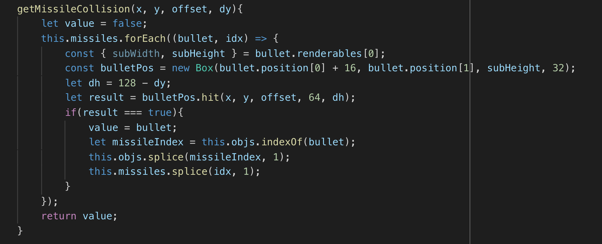
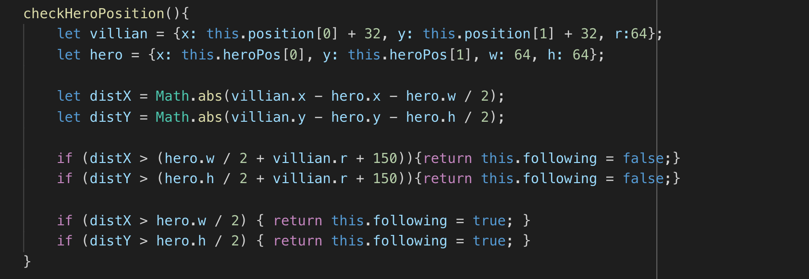
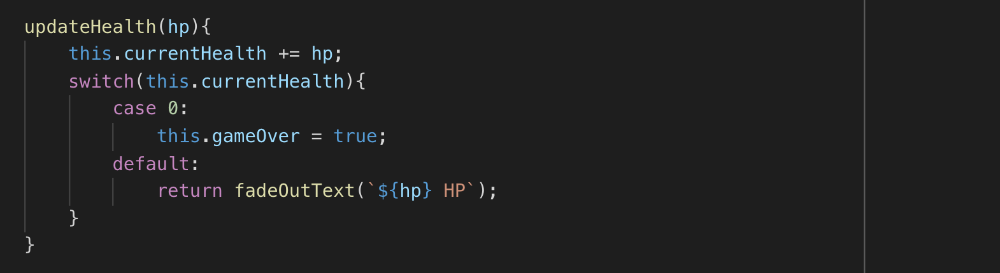

### Introduction | [Live](https://sewilee.github.io/Ooze_Awakening/)
The Legend of Slime is an adventure game.

Ooze the Slime, born as one of the lowest ranked monsters in the Forgotten Forest, ventures out of the village for the first time. It's one and only dream? To become a hero.

### Technologies
* JavaScript
* HTML Canvas
* CSS
* Adobe Photoshop
* Adobe Illustrator

### Features
* Scrolling Tilemaps
* Collison Detection
    * Player vs Static Objects
    * Monster vs Player
    * Player vs Items
    * Player's attack vs Monsters

    
* Player and Monster Encounter
    * Hero
        * move
        * attack
    * Monster
        * move
        * attack
        * homing feature

        
* Custom Artwork and Animations

* Health Count

### Development Timeline
Day 1: 
- learn canvas mapping, animation, scrolling, sprites
- project skeleton & wireframe
    
Day 2: 
- learn player interaction, collision and map scrolling

Day 3: 
- learn and separate components to classes
- animate default hero sprite, map sprite

Day 4: 
- add collisions and map scrolling feature
- add css to front page

Day 5: 
- add hero and villian abilites feature

Day 6: 
- draw custom sprites and implement

Day 7: 
- add health counter
